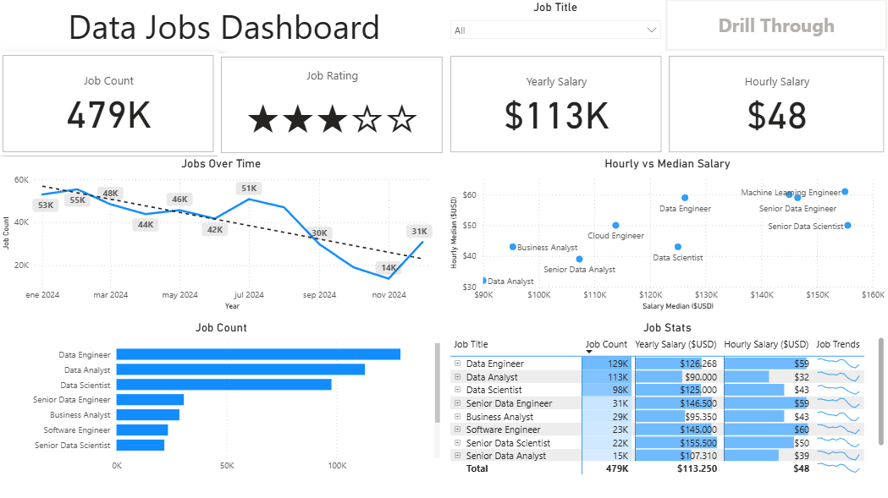
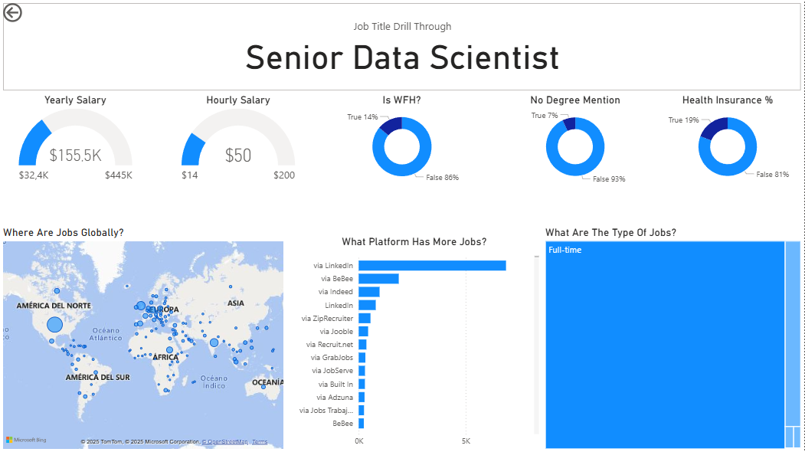

# Data Jobs Dashboard

This project is a Power BI dashboard that explores trends in data-related jobs, including demand, salaries, and job roles.

---

## Objective

Analyze the data job market and identify patterns in:

* Job demand
* Salary distribution
* Role popularity

---

## Tools Used

* Microsoft Power BI
* Data Visualization

---

## Dashboard Overview

This dashboard includes:

* Total number of job listings
* Average yearly and hourly salaries
* Job demand over time
* Comparison between salary and job roles
* Drill-through functionality for deeper analysis

---

## Dashboard Preview

---

## Key Insights

* Data Engineer roles show the highest demand
* Machine Learning and Senior roles have the highest salaries
* Job demand fluctuates over time with noticeable trends
